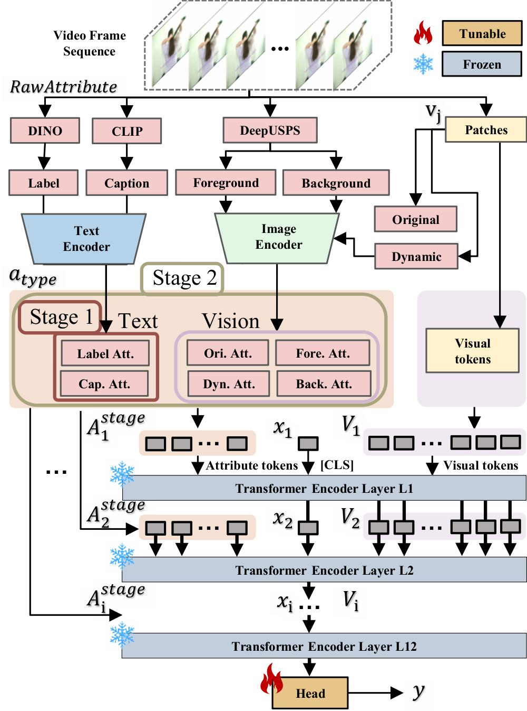

# EVA: Enabling Video Attributes with Hierarchical Prompt Tuning for Action Recognition 

Our code will be available after review.

<p align="center"></p>
Fig> 1 Comparison between the proposed EVA method and alternative fine-tuning approaches. (a) demonstrates Full fine-tune process; (b) illuminates traditional parameter-efficient fine-tuning (PEFT) process; (c) depicts our proposed novel EVA process; (d) demonstrates the implementation of different PEFT methods on the transformer structure; (e) illuminates the implementation of our EVA (Enabling Video Attributes with Hierarchical Prompt Tuning) method.
<p align="center"></p>
Fig.2 The overall framework of our EVA method first extracts and encodes video attributes and visual patches into tokens and then concatenates video attribute prompts, visual tokens, and a classification token [CLS] to form the input. Each Transformer layer processes multiscale video attributes aligned with the attribute encoder layer, along with the visual tokens output from the preceding layer. In stage 1, EVA incorporates only text-based attributes, including labels and captions. In stage 2, both textual and visual modality video attributes are integrated.

## Installation

- Create a conda environment: ```conda create -n aat python=3.9```
- Install PyTorch 1.7.1+ and Torchvision 0.8.2+ 
- ```pip3 install -r requirements.txt```

## Dataset setup

```bash
${ROOT}/
|-- data
|   |-- UCF101
|   |-- HMDB51
|   |-- ActivityNet
|   |-- SthSthV2

```

## Download pretrained model

The pretrained model can be found in [here](), please download it and put it in the ```'./checkpoint/pretrained'``` directory of the corresponding baseline methods.  

## Train the model

To train on a model:

```bash
python train.py --config-file config.yaml
```


## Citation

If you find our work useful in your research, please consider citing:

## Licence

This project is licensed under the terms of the MIT license.
